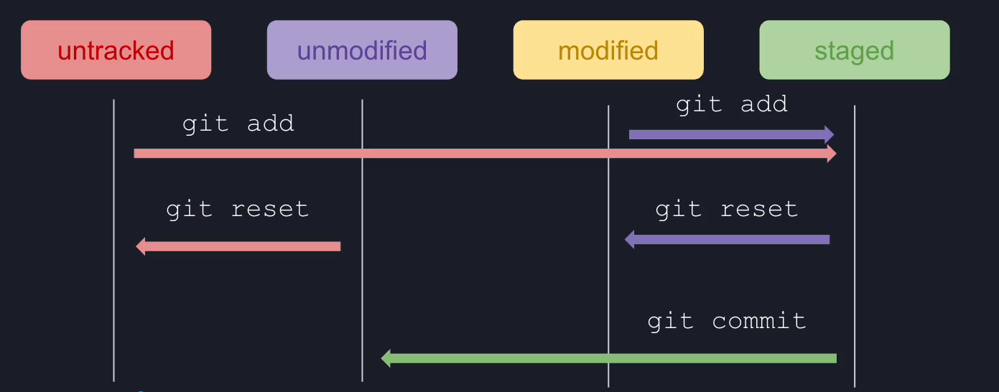

# Git Guide

## Controle de Versão

- Responsável por versionar os arquivos do seu projeto;
- Facilita a gestão e trabalho através de uma *timeline*;
- O Git trabalha com alterações de estado dos arquivos.

---


- ******untracked****** - o git ainda não conhece a existência do arquivo em nenhuma versão;
- **staged -** Ficam os arquivos que estão prontos para serem inseridos na nova versão;
- **********************unmodified********************** - Os arquivos que não sofreram alteração desde a última versão conhecida pelo Git;
- **********************modified -********************** Os arquivos que sofreram alteração desde a última versão conhecida pelo Git;

---

Consultar o status dos arquivos utilizamos o comando:

```bash
git status
```

Adicionar um arquivo para staged

```bash
Adicionar determinado arquivo
git add file_name

Adicionar todos os arquivos presentes
git add .
git add *
```

Resetar commit

```bash
Resetar determinado arquivo
git reset file_name

Resetar todos os arquivos presentes
git reset
```

Para consultar commit utilizamos:

```bash
git log
```

O **commit** é utilizado para avisar o git que queremos gerar um novo estado com os arquivos em **************staged**************.

```bash
git commit -m "comente sua alteração"
```

Branches criam uma linha do tempo alternativa para trabalharmos em paralelo.

Criar uma nova branch

```bash
git branch branch_name
```

Mudar para outra branch

```bash
git checkout branch_name
```

Unir branch’s

```bash
git merge branch_name
```

Ver a diferença entre versões de um arquivo

```bash
git diff file_name
```

Voltar para a última versão conhecida pelo git de um arquivo

```bash
git checkout file_name
```

Voltar para o último commit mas deixando os arquivos no staged

```bash
git reset --soft commit_id
```

Voltar para o último commit mas deixando os arquivos no modified

```bash
git reset --mixed commit_id
```

Voltar para o último commit mas desfazendo TODAS as alterações no arquivo

```bash
git reset --hard commit_id
```

Ver qual remote

```bash
git remote
git remote -v
```

Enviar para o repositório remoto

```bash
git push origin main
```

Puxar o repositório remoto para o repositório local

```bash
git pull origin main
```

Ver a timeline por um gráfico

```bash
git log --graph
```

Apagar uma branch

```bash
git branch -d branch_name
```

Criar uma branch e já mudar pra ela

```bash
git checkout -b branch_name
```

**Extensão Visual Studio Code:** Git History

Ver lista de alterações no stash

```bash
git stash list
```

Puxar alterações do stash

```bash
git stash apply
```

Ecluir alterações do stash

```bash
git stash clear
```

Adicionar código no stash juntamente com arquivos untracked

```bash
git stash --include-untracked
```

Desfazer um commit mantendo o histórico

```bash
git revert id_commit
```

Mostrar mudanças que foram feitas em determinado commit

```bash
git show id_commit
```

Fazer o pull colocando seus posśiveis commits em ordem cronologica com os commits do repo remoto

```bash
git pull origin main --rebase
```

Continuar após um merge

```bash
git merge --continue
```

Continuar após um rebase

```bash
git rebase --continue
```

### Pull Request (PR)

Utilizado para solicitar o merge de uma branch em outra branch no nosso repositório remoto.

## Workflows

- Centralized;
    - Usado para quando se está sozinho, ou em times pequenos, todos fazem commit diretamente na main.
- Feature Branch;
    - Todos os desenvolvedores utilizam novas branches para construir novos recursos.
- Gitflow.
    - Todos os desenvolvedores trabalham com um modelo estrito de branches projetado em torno do lançamento do projeto.